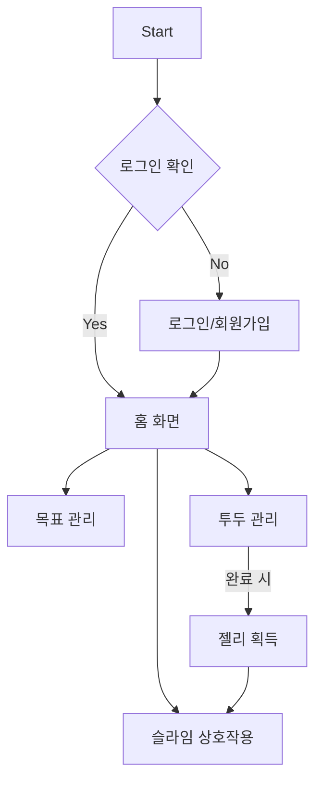

# ToonDo


**Home Screen**


**Goal Manage & Input Screen**


**Todo List Screen**


## Introduction

**ToonDo**는 삼성꿈장학재단 장학생들이 모여 개발한 **목표 관리 및 동기 부여형 투두리스트 앱**입니다. 이 프로젝트는 재단으로부터 300만 원 규모의 스폰을 받아 진행되었습니다.

단순한 투두리스트를 넘어 **슬라임 캐릭터와의 상호작용**을 통해 성취감을 극대화하며, 사용자 맞춤형 목표 분석 및 피드백 기능을 제공합니다.

## Key Features

- **슬라임 캐릭터와의 상호작용 🟢**: 목표 달성에 따른 캐릭터 피드백 및 젤리 보상 시스템.
- **체계적인 목표 관리 & 분석 📊**: 학기/기간별 목표 설정 및 달성 패턴 데이터 분석.
- **아이젠하워 매트릭스 투두 ✅**: 긴급도와 중요도에 따른 우선순위 관리.
- **슬라임 꾸미기 🎨**: 획득한 젤리를 활용한 캐릭터 커스터마이징.

## Tech Stack & Architecture

ToonDo는 대규모 협업과 유지보수를 위해 **Clean Architecture** 기반의 **Multi-Package** 구조로 설계되었습니다.

### Architecture Patterns
- **Multi-Package Strategy**: 레이어(Domain, Data, Presentation) 및 공통 모듈(Common)을 독립된 패키지로 분리.
- **Clean Architecture**: 비즈니스 로직(Domain)이 프레임워크나 외부 라이브러리에 의존하지 않도록 설계.
- **MVVM Pattern**: Presentation 레이어에서 `Provider`를 활용하여 UI와 비즈니스 로직을 분리.

### Core Technologies
- **Framework**: Flutter
- **State Management**: Provider
- **Dependency Injection**: `get_it`, `injectable`
- **Database**: Hive (Local Cache), PostgreSQL (Remote DB)
- **Animation**: Rive (Slime Interactive Animation)
- **UI Utils**: `flutter_screenutil` (반응형 레이아웃), `table_calendar`, `flutter_svg`
- **Network**: `http` (REST API)

## Project Structure

```
/toondo
├── lib/                   # App Entry Point & Global Config
│   ├── injection/         # DI Container Setup
│   └── main.dart          # Application Entry
│
└── packages/              # Modularized Layers
    ├── common/            # Shared Utilities, Constants, Assets Generation
    │   └── lib/
    │       ├── audio/     # Audio Service (BGM/Sound Effects)
    │       ├── constants/ # Global App Constants
    │       └── gen/       # Assets/Fonts/Colors Generated by flutter_gen
    │
    ├── domain/            # Domain Layer (Pure Dart)
    │   └── lib/
    │       ├── entities/  # Core Business Objects
    │       ├── repositories/# Repository Interfaces
    │       └── usecases/  # Discrete Business Logic Units
    │
    ├── data/              # Data Layer
    │   └── lib/
    │       ├── datasources/ # External API & Local Storage Access
    │       ├── repositories/# Repository Implementations
    │       └── models/      # Data Transfer Objects (DTO) & Mappers
    │
    └── presentation/      # Presentation Layer
        └── lib/
            ├── views/       # Screens & UI Components
            ├── viewmodels/  # Logic & State Management (Provider)
            ├── designsystem/# Unified UI Kit (Colors, TextStyles)
            └── navigation/  # App Routing & Deep Links
```

## How to Run the App

### Requirements
- **Flutter SDK**: 3.4.3+
- **Dart SDK**: 3.x

### Setup & Execution
1. **의존성 설치**: 루트 디렉토리에서 실행하여 모든 로컬 패키지의 의존성을 해결합니다.
   ```bash
   flutter pub get
   ```
2. **코드 생성 (Build Runner)**: Hive TypeAdapter, Injectable DI 등을 위해 실행합니다.
   ```bash
   dart run build_runner build --delete-conflicting-outputs
   ```
3. **앱 실행**:
   ```bash
   flutter run
   ```

## App Flow


