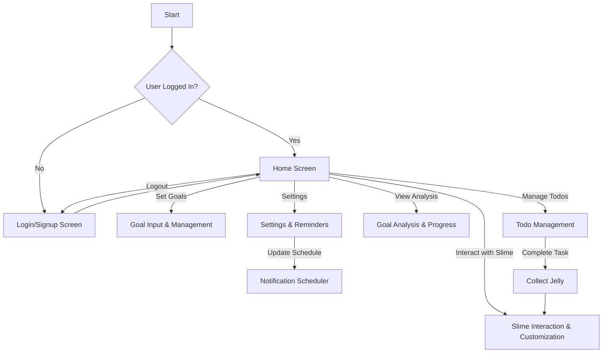

# ToonDo


**Home Screen**


**Goal Manage & Input Screen**


**Todo List Screen**


## Introduction

**ToonDo**는 삼성꿈장학재단 장학생들이 모여 개발한 **목표 관리 및 동기 부여형 투두리스트 앱**입니다. 이 프로젝트는 재단으로부터 300만 원 규모의 스폰을 받아 진행되었습니다.

**ToonDo**는 단순한 투두리스트 앱을 넘어, **슬라임 캐릭터와의 상호작용**을 통해 목표 달성의 재미를 더하고, 동기 부여를 강화하는 요소를 추가할 예정입니다. 또한, 삼성꿈장학재단의 **우수한 졸업생들의 "갓생" 데이터**를 분석하여, 일반 대학생들이 이루고자하는 목표를 설정하면 달성할 수 있도록 분석과 피드백을 제공할 계획입니다.

## Who Should Use This App?

이 앱은 한 학기 동안 3가지 주요 목표를 설정하고 이를 성취하기 위해 꾸준히 노력하는 사람들에게 최적화된 도구입니다. 목표를 체계적으로 관리하고 싶은 모든 분들께 추천합니다. 특별히 다음과 같은 사용자라면 ToonDo를 사용하기에 적합합니다.

- **꿈아라 (삼성꿈장학재단 장학생) & 목표 지향적인 학생**: 학업 일정, 과제 및 시험을 효과적으로 관리해야 하는 청소년 및 대학생들.
- **자기계발을 추구하는 사람**: 피트니스, 독서를 비롯해서 자기계발 관련 습관을 형성하고 진행 상황을 남기고자 하는 사람들.

## Key Features

- **슬라임 캐릭터와의 상호작용 🟢**
목표를 달성하고 투두를 완료할 때마다 슬라임 캐릭터가 긍정적인 피드백을 제공하며 동기 부여를 도와줍니다.
- **체계적인 목표 관리 & 분석 📊**
한 학기(또는 일정 기간) 동안 약 세 개의 목표를 설정하고, 목표 달성률과 패턴을 분석하여 더욱 효과적으로 계획할 수 있도록 도와줍니다.
- **투두 리스트 정리 & 관리 ✅**
일일 작업을 보기 쉽게 정리하고, 슬라이더를 통해 진행률을 조절하며 직관적으로 관리할 수 있습니다.또한 아이젠하워 매트릭스 방식으로 투두의 우선순위를 정합니다.
- **맞춤형 일정 관리 & 알림 ⏰ (구현 예정)**
사용자가 원하는 시간에 투두 및 목표 진행 관련 알림을 설정하여 체계적인 시간 관리가 가능합니다.
- **젤리 시스템 & 슬라임 꾸미기 🎨**
투두를 수행할 때마다 젤리를 획득하여 슬라임을 꾸밀 수 있으며, 이를 통해 성취감을 더욱 극대화할 수 있습니다.

## How to Run the App

### Requirements

- **Flutter SDK**: 버전 3.x 이상
- **Dart**: 버전 2.x 이상
- Android/iOS 테스트를 위한 에뮬레이터 또는 실제 기기

### Steps to Run the App

1. **리포지토리 클론**:
   프로젝트 리포지토리를 클론하려면 다음 명령어를 실행하세요:
   ```bash
   git clone https://github.com/sjin4861/todo_with_alarm.git
   cd todo_with_alarm
   ```


2. **의존성 설치**:
    Flutter 패키지 매니저를 사용하여 필요한 의존성을 설치하세요:
    ```bash
    flutter pub get
    ```

3.	**Firebase 설정 (인증에 Firebase를 사용하는 경우, 아직 구현되지 않음)**:
- Android: android/app/ 디렉토리에 google-services.json 파일을 추가하세요.
- iOS: Xcode의 Runner 프로젝트에 GoogleService-Info.plist 파일을 추가하세요.

4.	**앱 실행**:
    앱을 실행하려면 다음 명령어를 사용하세요:
    ```bash
    flutter run
    ```

### Development Information

**사용된 주요 기술**
- Flutter: 사용자 인터페이스를 구축하고 상태 관리를 처리하기 위한 기본 프레임워크.
- Dart: Flutter와 함께 사용되는 프로그래밍 언어.
- Provider: 목표 및 투두 관리 등 전반적인 앱 상태 관리를 위해 사용.
- Hive & Hive Flutter: 빠르고 가벼운 로컬 데이터 저장소로 사용.
- PostgreSQL: 데이터베이스와 연동하여 목표 및 투두 데이터를 서버에 저장하고 관리.
- Rive: 슬라임 캐릭터 애니메이션을 부드럽고 생동감 있게 표현하기 위한 패키지.
- Spring Boot: 백엔드 프레임워크로 사용되어 API 개발 및 데이터 관리를 담당.

## 프로젝트 구조 요약  

### 📂 `lib/` (메인 프로젝트 폴더)  
- **`app/`**: 라우팅 및 테마 관련 설정 (`router.dart`, `theme.dart`)  
- **`models/`**: 목표, 투두, 사용자 등의 데이터 모델 정의  
- **`services/`**: 인증, 목표, 알림 등 비즈니스 로직을 처리하는 서비스 계층  
- **`utils/`**: 날짜, 색상, 알림 등의 유틸리티 함수 모음  
- **`viewmodels/`**: MVVM 패턴의 뷰모델, 목표 및 투두 관리 로직 포함  
- **`views/`**: 로그인, 목표, 투두, 온보딩 등 UI 화면 구성  
- **`widgets/`**: 앱에서 재사용 가능한 위젯 모음 (슬라임 캐릭터, 캘린더, 버튼 등)  

### App Flowchart

아래는 앱의 네비게이션과 주요 기능에 대한 간략한 플로우차트입니다:
