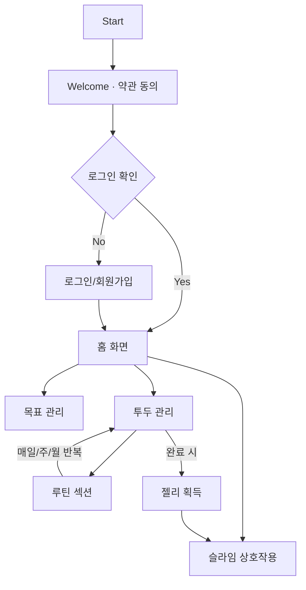

# ToonDo


**Home Screen**


**Goal Manage & Input Screen**


**Todo List Screen**


## Introduction

**ToonDo**는 삼성꿈장학재단 장학생들이 모여 개발한 **목표 관리 및 동기 부여형 투두리스트 앱**입니다. 이 프로젝트는 재단으로부터 300만 원 규모의 스폰을 받아 진행되었습니다.

단순한 투두리스트를 넘어 **슬라임 캐릭터와의 상호작용**을 통해 성취감을 극대화하며, 사용자 맞춤형 목표 분석 및 피드백 기능을 제공합니다.

## Key Features

- **슬라임 캐릭터와의 상호작용 🟢**: 목표 달성에 따른 캐릭터 피드백 및 젤리 보상 시스템.
- **체계적인 목표 관리 & 분석 📊**: 학기/기간별 목표 설정 및 달성 패턴 데이터 분석.
- **아이젠하워 매트릭스 투두 ✅**: 긴급도와 중요도에 따른 우선순위 관리.
- **반복 투두(루틴) 🔁**: 매일/매주/매달 빈도와 종료 조건(무한 ∞ · 특정 날짜 D-N · 횟수 N회)을 RRULE 스타일로 설정. 홈/투두 화면에서 잔여 횟수가 자동 카운트다운.
- **슬라임 꾸미기 🎨**: 획득한 젤리를 활용한 캐릭터 커스터마이징.
- **광고 배너 📣**: 목표 관리 화면 상단 배너로 외부 캠페인 노출.
- **약관 동의 흐름 📜**: Welcome 단계에서 약관 바텀시트를 통한 명시적 동의 처리.

## Tech Stack & Architecture

ToonDo는 대규모 협업과 유지보수를 위해 **Clean Architecture** 기반의 **Multi-Package** 구조로 설계되었습니다.

### Architecture Patterns
- **Multi-Package Strategy**: 레이어(Domain, Data, Presentation) 및 공통 모듈(Common)을 독립된 Flutter 패키지로 분리.
- **Clean Architecture**: 비즈니스 로직(Domain)이 프레임워크나 외부 라이브러리에 의존하지 않도록 설계.
- **MVVM Pattern**: Presentation 레이어에서 `Provider` + `ChangeNotifier`를 활용하여 UI와 비즈니스 로직을 분리.

의존성 방향은 **presentation → domain ← data**로 단방향이며, `common`은 모든 레이어에서 사용 가능합니다. 상세 가이드는 [`toondo/lib/docs/architecture.md`](toondo/lib/docs/architecture.md) 참고.

### Core Technologies
- **Framework**: Flutter (Dart `>=3.4.3 <4.0.0`)
- **State Management**: `provider` + `ChangeNotifier`
- **Dependency Injection**: `get_it`, `injectable` (코드젠)
- **Local DB**: Hive (`TypeAdapter`s는 `toondo/lib/main.dart`에서 등록)
- **Remote**: Dio + Retrofit, `MockApiInterceptor`로 백엔드 부재 시 캐닝 응답 제공
- **Animation**: Rive (슬라임 인터랙티브)
- **UI**: `flutter_screenutil` (반응형), `table_calendar`, `flutter_svg`
- **Generated Assets**: `flutter_gen` (출력 위치: `packages/common/lib/gen/`)

## Project Structure

```
toondo/
├── lib/                              # 앱 엔트리 / DI 부트스트랩 / Hive 어댑터 등록
│   ├── main.dart
│   ├── injection/di.dart             # data/domain/presentation 마이크로패키지 wiring
│   ├── constants/                    # 앱 전역 상수
│   ├── docs/architecture.md          # 레이어 책임 가이드
│   └── utils/
│
├── assets/                           # 앱 번들 에셋 (rives/, icons/, images/, audios/, fonts/)
│
├── packages/
│   ├── common/                       # 모든 레이어에서 공유 가능한 코드
│   │   └── lib/
│   │       ├── audio/                # AudioGate / BGM·SFX
│   │       ├── constants/            # AuthConstraints 등 도메인-중립 상수
│   │       ├── notification/         # 로컬 알림 헬퍼
│   │       ├── utils/
│   │       └── gen/                  # flutter_gen 산출물 (assets/colors/fonts)
│   │
│   ├── domain/                       # 순수 Dart: 외부 패키지 의존 최소
│   │   └── lib/
│   │       ├── entities/             # Goal, Todo, User, SlimeCharacter ...
│   │       ├── repositories/         # 인터페이스만 (auth, goal, todo, slime ...)
│   │       └── usecases/             # auth · goal · todo · character · notification ...
│   │
│   ├── data/                         # Repository 구현 + 외부 어댑터
│   │   └── lib/
│   │       ├── datasources/
│   │       │   ├── local/            # Hive 기반 (todo, goal, user, auth ...)
│   │       │   └── remote/           # Dio 기반 REST 호출
│   │       ├── models/               # DTO + DTO↔Entity 매퍼
│   │       ├── network/              # DioClient, MockApiInterceptor, MockResponseRegistry
│   │       ├── repositories/         # *RepositoryImpl
│   │       └── utils/
│   │
│   └── presentation/
│       └── lib/
│           ├── views/                # 스크린 위젯 (auth · home · goal · todo · mypage · onboarding · welcome)
│           ├── viewmodels/           # ChangeNotifier 기반 ViewModel
│           ├── designsystem/         # colors · typography · spacing · dimensions · components
│           ├── navigation/router.dart # AppRouter.generateRoute (중앙집중 라우팅)
│           ├── models/               # UI 전용 모델
│           ├── utils/                # 화면 단위 유틸
│           └── injection/            # @module DI 모듈
│
└── tools/                            # CLI 헬퍼 (health_check.dart 등)
```

## How to Run the App

### Requirements
- **Flutter SDK**: 3.4.3 이상
- **Dart SDK**: 3.x

### Setup & Execution

모든 명령은 `toondo/` 디렉토리에서 실행하세요 (저장소 루트 X).

1. **의존성 설치** — path 기반 로컬 패키지(common/data/domain/presentation)까지 자동 해결됩니다.
   ```bash
   flutter pub get
   ```

2. **코드 생성** — `@injectable` DI 컨테이너, Hive `TypeAdapter`, `flutter_gen` 에셋 클래스 등을 생성합니다.
   ```bash
   dart run build_runner build --delete-conflicting-outputs
   ```
   > 어노테이션, Hive 모델, `pubspec.yaml`의 `assets:` 항목을 수정한 뒤에는 다시 실행하세요.

3. **앱 실행**
   ```bash
   flutter run
   ```

### Testing

```bash
flutter test                                # 루트 패키지 단위 테스트
cd packages/data && flutter test            # 서브 패키지별 테스트 (각 패키지에 자체 test/ 보유)
flutter test integration_test               # 통합 테스트
flutter test --plain-name "<test name>"     # 특정 테스트만
```

## Code Generation Notes

`pubspec.yaml`의 `dependency_overrides`는 현행 Flutter SDK(`_macros` 제거)와 다음 패키지 조합을 호환시키기 위한 핀입니다:

- `dart_style 2.3.6` / `analyzer 6.4.1` — 구버전 generator(`hive_generator 2.x`, `injectable_generator 2.6.x`, `source_gen 1.5.x`)가 요구하는 analyzer API에 맞춤
- `flutter_gen_core 5.7.0` / `flutter_gen_runner 5.7.0` — 5.9는 `dart_style 3.x`의 `latestLanguageVersion`을 요구하므로 다운피닝
- `build_runner 2.4.13` / `build_resolvers 2.4.2` / `build_runner_core 7.3.2` — analyzer 6.4와 호환되는 마지막 세트

이 핀은 generator 패키지들이 newer analyzer를 지원할 때 일괄 제거할 수 있습니다.

생성 파일은 손으로 수정하지 마세요:
- `**/*.g.dart`, `**/*.config.dart` (build_runner 산출물)
- `packages/common/lib/gen/**` (flutter_gen 산출물)

## App Flow


```mermaid
flowchart TD
    Start[Start] --> Welcome[Welcome · 약관 동의]
    Welcome --> CheckAuth{로그인 확인}
    CheckAuth -- Yes --> HomeScreen[홈 화면]
    CheckAuth -- No --> AuthScreen[로그인/회원가입]
    AuthScreen --> HomeScreen
    HomeScreen --> GoalScreen[목표 관리]
    HomeScreen --> TodoScreen[투두 관리]
    HomeScreen --> SlimeScreen[슬라임 상호작용]
    TodoScreen --> RoutineSection[루틴 섹션]
    RoutineSection -->|매일/주/월 반복| TodoScreen
    TodoScreen -->|완료 시| Jelly[젤리 획득]
    Jelly --> SlimeScreen
```
