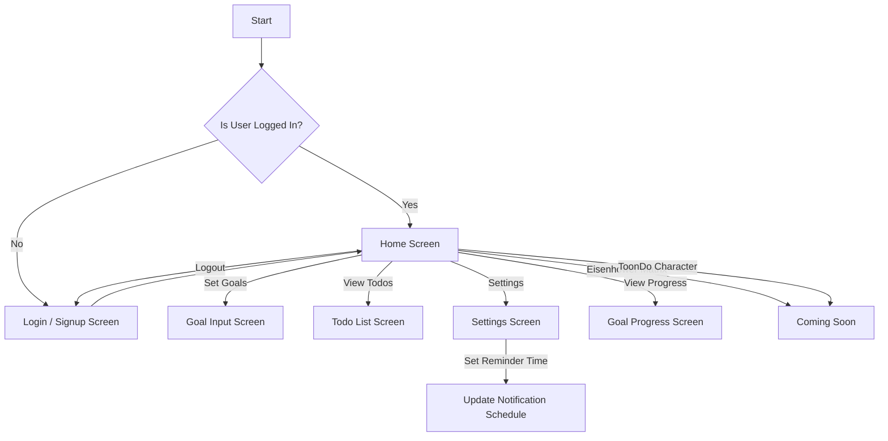

# Todo with Alarm

## Introduction

**Todo with Alarm**은 사용자가 맞춤형 알림을 통해 작업과 목표를 설정하고 관리할 수 있도록 도와주는 생산성 향상 모바일 앱입니다. 일일 작업 설정, 장기 목표 추적, 적시에 알림 받기 등 개인 또는 전문적인 목표에 맞춰 생산성을 향상시키고 사용자가 목표를 달성할 수 있도록 돕습니다. 이 앱은 AI 기반의 우선순위 설정 방법, 목표 추적 및 푸시 알림을 활용하여 사용자가 조직적이고 일관되게 행동할 수 있도록 지원합니다.

## Who Should Use This App?

이 앱은 다음과 같은 사용자에게 적합합니다:

- **학생**: 학업 일정, 과제 및 시험을 효과적으로 관리해야 하는 학생들.
- **전문가**: 업무 관련 작업, 마감일 및 회의를 추적하고자 하는 전문가들.
- **개인 발전을 추구하는 사람들**: 피트니스, 독서 또는 개인 성장 등에서 습관을 형성하고 진행 상황을 추적하고자 하는 사람들.
- **생산성 애호가**: 맞춤형 일일 알림과 루틴으로 규율 있고 조직적인 생활을 원하는 사람들.

## Key Features

- **목표 생성 및 관리**: 앱 시작 시 최대 세 개의 주요 목표를 설정하고, 이름, 시작 날짜, 종료 날짜 등의 세부 매개변수를 지정할 수 있습니다.
- **작업 관리**: 일일 작업을 쉽게 생성하고 관리하며, 슬라이더를 통해 작업 진행률을 업데이트할 수 있습니다.
- **사용자 인증**: 앱 내에서 안전하게 회원가입, 로그인 및 계정 관리를 할 수 있습니다.
- **설정 및 사용자 정의**: 알림 시간 등 설정을 조정하여 일정에 맞출 수 있습니다.
- **맞춤형 알림**: 특정 시간에 작업 또는 목표에 대한 알림을 설정하여 일정에 맞출 수 있습니다.
- **일일 푸시 알림**: 다가오는 작업과 목표 리뷰에 대한 적시 알림을 받습니다.
- **진행 상황 추적**: 목표 달성률을 추적하고 일일 작업 성과에 대한 인사이트를 얻을 수 있습니다.
- **아이젠하워 매트릭스 통합 (아직 구현되지 않음)**: *개발 중인 기능입니다. 앱은 가장 긴급하고 중요한 작업에 집중할 수 있도록 아이젠하워 매트릭스를 통합할 예정입니다.*
- **AI 기반 우선순위 설정 (아직 구현되지 않음)**: *개발 중인 기능입니다. 앱은 OpenAI의 API를 활용하여 목표와 투두를 기반으로 작업의 긴급성과 중요성을 자동으로 계산할 예정입니다.*
- **ToonDo 캐릭터 및 우편함 (아직 구현되지 않음)**: *개발 중인 기능입니다. ToonDo 캐릭터와 상호 작용하고 더 재미있는 경험을 위해 우편함에서 메시지를 받을 수 있습니다.*
- **적정 목표 진행률 알고리즘 (아직 구현되지 않음)**: *개발 중인 기능입니다. 앱은 목표 진행률의 최적 계산을 위한 알고리즘을 포함할 예정입니다.*

## How to Run the App

### Requirements

- **Flutter SDK**: 버전 3.x 이상
- **Dart**: 버전 2.x 이상
- Android/iOS 테스트를 위한 에뮬레이터 또는 실제 기기

### Steps to Run the App

1. **리포지토리 클론**:
   프로젝트 리포지토리를 클론하려면 다음 명령어를 실행하세요:
   ```bash
   git clone https://github.com/username/todo_with_alarm.git
   cd todo_with_alarm
   ```


2. **의존성 설치**:
    Flutter 패키지 매니저를 사용하여 필요한 의존성을 설치하세요:
    ```bash
    flutter pub get
    ```

3.	**Firebase 설정 (인증에 Firebase를 사용하는 경우)**:
- Android: android/app/ 디렉토리에 google-services.json 파일을 추가하세요.
- iOS: Xcode의 Runner 프로젝트에 GoogleService-Info.plist 파일을 추가하세요.

4.	**앱 실행**:
    앱을 실행하려면 다음 명령어를 사용하세요:
    ```bash
    flutter run
    ```

### Development Information

**사용된 기술**
- Flutter: 사용자 인터페이스를 구축하고 상태 관리를 처리하기 위한 기본 프레임워크.
- Dart: Flutter와 함께 사용되는 프로그래밍 언어.
- Firebase Authentication: 사용자 등록, 로그인 및 인증을 위해 사용.
- Flutter Local Notifications: 작업 알림을 예약하고 보내기 위한 패키지.
- SharedPreferences: 사용자 설정 및 선호도를 로컬로 저장하는 데 사용.
- Timezone 패키지: 사용자의 시간대를 기반으로 알림 스케줄링을 관리하기 위해 사용.
- Provider: 목표와 투두 등 앱 전반의 상태 관리를 위해 사용.

**프로젝트 구조**
```bash
lib/
│
├── models/             # 목표, 투두, 알림 등의 데이터 모델
├── providers/          # 목표, 투두, 설정에 대한 상태 관리
├── screens/            # 로그인, 회원가입, 홈, 목표 입력, 설정 등의 UI 화면
├── services/           # GoalService, NotificationService 등의 서비스 포함
├── widgets/            # 화면 전반에서 사용되는 커스텀 위젯
└── main.dart           # 앱의 메인 진입점
```


### App Flowchart

아래는 앱의 네비게이션과 주요 기능에 대한 간략한 플로우차트입니다:
